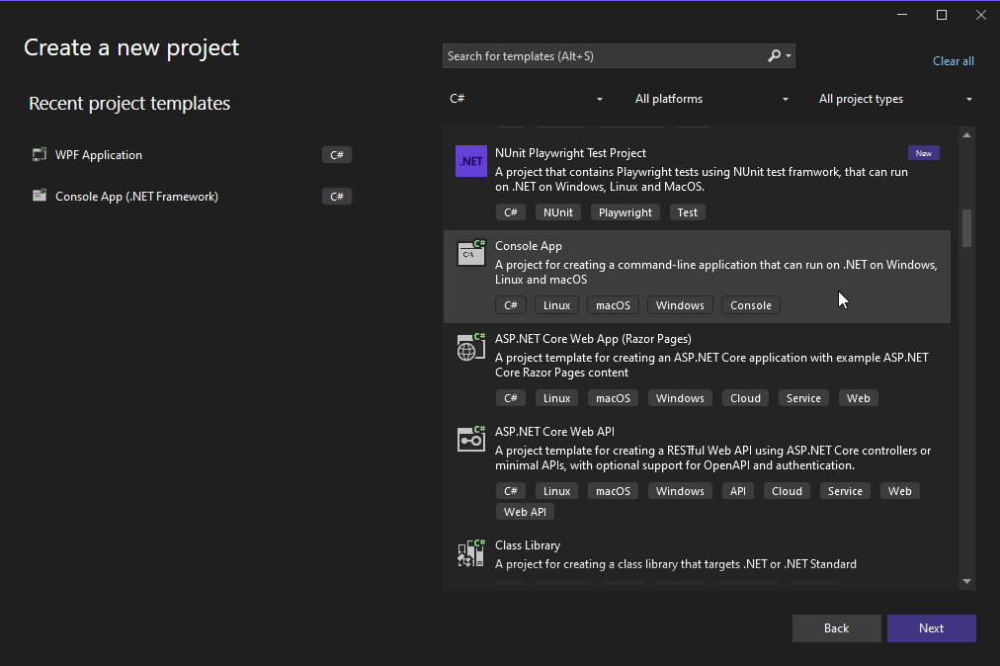
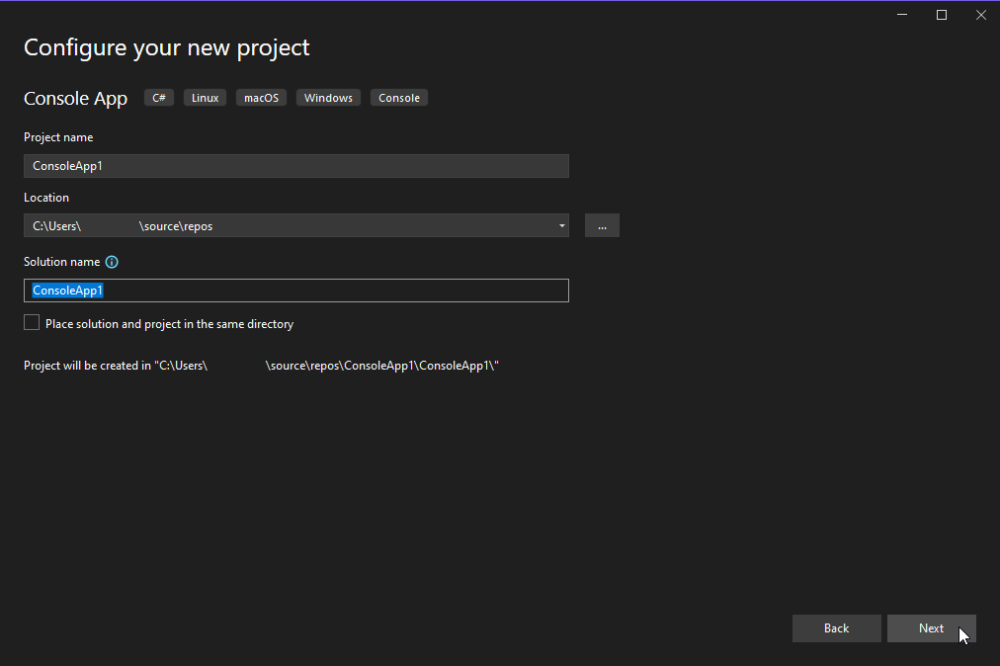
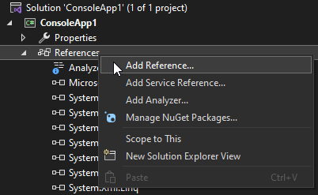
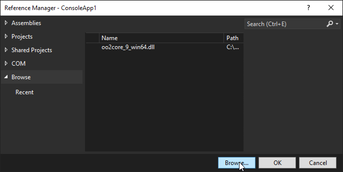

# Basic Usage

### Prerequisites
* Visual Studio 2017 or later
* [A copy of UAssetAPI](./build.md)

### Basic Project Setup
In this short guide, we will go over the very basics of parsing assets through UAssetAPI.

UAssetAPI targets [.NET Standard 2.0](https://learn.microsoft.com/en-us/dotnet/standard/net-standard?tabs=net-standard-2-0), which means that UAssetAPI can be safely used with a variety of .NET Framework and .NET Core versions. We will start off in this specific guide by creating a new C# Console App project in Visual Studio, and we will target .NET Framework 4.7.2:

Once we have entered Visual Studio, we must add a new reference to our UAssetAPI.dll file. This can be done by right-clicking under "References," clicking "Add Reference," clicking "Browse" in the bottom right of the Reference Manager window, browsing to your UAssetAPI.dll file on disk, and clicking "OK".

Once you've referenced the UAssetAPI assembly in your project, you're ready to start parsing assets!

## Using UAssetAPI with UE4 Assets
Every Unreal Engine 4 parsed with UAssetAPI is represented by the [UAsset](../api/uassetapi.uasset.md#constructors) class. The simplest way to construct a UAsset is to initialize it with the path to the asset on disk (note that if your asset has a paired .uexp file, both files must be located in the same directory, and the path should point to the .uasset file) and an [EngineVersion](../api/uassetapi.unrealtypes.engineversion.html#fields).

I will be analyzing a small asset from the video game [Ace Combat 7](https://www.bandainamcoent.com/games/ace-combat-7) (4.18) for this demonstration, which can be downloaded here:
- [plwp_6aam_a0.uasset](../samples/plwp_6aam_a0.uasset) &rarr; `C:\plwp_6aam_a0.uasset`
- [plwp_6aam_a0.uexp](../samples/plwp_6aam_a0.uexp) &rarr; `C:\plwp_6aam_a0.uasset`